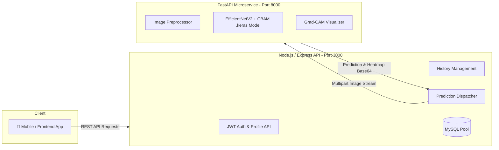

# 🍄 MycoTrack - Backend & AI Prediction Service

[](https://nodejs.org/)
[](https://expressjs.com/)
[](https://www.python.org/)
[](https://fastapi.tiangolo.com/)
[](https://www.tensorflow.org/)
[](https://www.mysql.com/)

A comprehensive backend platform powering **MycoTrack** (Skin Disease Detection & Fungal Infection Classification). The system incorporates a dual-tier architecture consisting of an Express.js API gateway, a high-performance Python FastAPI microservice for deep learning inference, and a MySQL relational database for user records and detection history.

---

## 📌 Architecture Overview



1. **Express.js Backend (`Port 3000`)**:
   - Manages user authentication (JWT-based registration, login, profile management, password recovery).
   - Handles multi-part file uploads (images & profile pictures).
   - Persists detection records, timestamps, confidence scores, and visual heatmaps.
   - Centralizes clinical mapping between deep learning output indices and canonical database IDs.

2. **FastAPI Microservice (`Port 8000`)**:
   - Loads a deep convolutional neural network model (`skin_classifier.keras` with custom CBAM attention layers).
   - Standardizes and preprocesses incoming skin lesion images.
   - Performs inference and returns probability distributions across classified conditions.
   - Computes **Grad-CAM (Gradient-weighted Class Activation Mapping)** to highlight regions of interest.

---

## 📂 Project Directory Structure

```text
backedend_github_uploads/
├── .env.example               # Template environment configuration
├── .gitignore                  # Git exclusions (Keras models, uploads, node_modules, etc.)
├── app.js                     # Node.js Express server entrypoint & port resolver
├── package.json               # Node.js dependencies & scripts
├── package-lock.json          # Node.js lockfile
│
├── ai_service/                # 🧠 Python FastAPI Microservice
│   ├── gradcam.py             # Grad-CAM heatmap visualization algorithm
│   ├── list_layers.py         # Utility script for inspecting model layers
│   ├── list_model_layers.py   # Layer diagnostic helper
│   ├── main.py                # FastAPI app entrypoint, CORS, inference endpoint
│   ├── preprocess.py          # Image resizing (300x300), normalization & transforms
│   └── requirements.txt       # Python dependencies (FastAPI, TensorFlow, OpenCV, etc.)
│
├── config/                    # Configuration modules
│   ├── db.js                  # MySQL connection pool & promise wrapper
│   └── diseaseMapping.js      # Canonical mapping: Model indices <-> Database IDs
│
├── controllers/               # Express Request Controllers
│   ├── authController.js      # Register, login, password reset, profile logic
│   ├── historyController.js   # Fetch and delete past detection records
│   └── predictController.js   # Pipeline orchestrator (Upload -> FastAPI -> DB -> Response)
│
├── database/                  # Database management
│   ├── ensureSchema.js        # Dynamic schema validator & disease baseline seeder
│   └── init.sql               # MySQL DDL schema and tables creation
│
├── docs/                      # Documentation
│   ├── API_DOCUMENTATION.md   # Complete REST API specifications & schemas
│   └── DEPLOYMENT.md          # Server setup & production guidelines
│
├── middleware/                # Express Middlewares
│   ├── auth.js                # JWT verification & token authorization
│   └── upload.js              # Multer configuration for file uploads
│
├── model/                     # ⚠️ Model weights storage (Ignored by Git)
│   └── skin_classifier.keras  # Place your trained Keras model here
│
├── routes/                    # API Route definitions
│   ├── authRoutes.js          # /api/auth endpoints
│   ├── historyRoutes.js       # /api/history endpoints
│   └── predictRoutes.js       # /api/predict endpoints
│
└── test/                      # Test suites and diagnostic scripts
```

---

## 🔬 Disease Classification & Index Mapping

The TensorFlow model was trained using `flow_from_directory()`. Because directory names are alphabetically sorted during dataset generation, the indices differ from the canonical relational database IDs. A dedicated mapping layer is maintained:

| Model Index | Directory Label | Canonical Disease Name | MySQL `disease_id` |
| :---: | :---: | :---: | :---: |
| `0` | **Cruris** | Tinea Cruris | `2` |
| `1` | **Other** | Other / Non-fungal | `0` |
| `2` | **Ringworm** | Ringworm (Tinea Corporis) | `1` |
| `3` | **Versicolor** | Tinea Versicolor | `3` |

---

## 🛠️ Prerequisites

Ensure you have the following installed on your machine:
- **Node.js** (v18.x or higher) & **npm**
- **Python** (v3.10 or v3.11 recommended)
- **MySQL Server** (via MySQL Community Server, MariaDB, or XAMPP)
- **Git**

---

## 🚀 Setup & Execution Guide

### Step 1: Database Setup
1. Start your **MySQL** server (e.g., via XAMPP control panel or `mysqld`).
2. Log into MySQL and run the initialization script:
   ```bash
   mysql -u root -p < database/init.sql
   ```
   *(Or import `database/init.sql` using phpMyAdmin / MySQL Workbench).*

---

### Step 2: Configure Environment Variables
Copy the example `.env.example` file to create your `.env` file in the project root:

```bash
cp .env.example .env
```

Edit `.env` to match your local setup:
```ini
PORT=3000
DB_HOST=localhost
DB_PORT=3306
DB_USER=root
DB_PASSWORD=your_mysql_password
DB_NAME=skin_disease_db
JWT_SECRET=replace_with_a_secure_random_string
FASTAPI_URL=http://127.0.0.1:8000
```

---

### Step 3: Set Up Model Weights
Due to file size limitations, trained weights (`*.keras`, `*.h5`) are excluded from Git repository tracking via `.gitignore`.
1. Ensure the `model/` folder exists in the root directory:
   ```bash
   mkdir -p model
   ```
2. Place your trained model file into `model/` as:
   ```text
   model/skin_classifier.keras
   ```
   *(Alternative paths checked by default: `ai_service/model/skin_classifier.keras`, `model/SkinDisease.keras`, or `.h5` equivalents).*

---

### Step 4: Run the Python AI Service

1. Open a terminal and navigate to the `ai_service` directory:
   ```bash
   cd ai_service
   ```
2. Create and activate a Python virtual environment:
   - **Windows (PowerShell / CMD)**:
     ```powershell
     python -m venv venv
     .\venv\Scripts\activate
     ```
   - **Linux / macOS**:
     ```bash
     python3 -m venv venv
     source venv/bin/activate
     ```
3. Install dependencies:
   ```bash
   pip install --upgrade pip
   pip install -r requirements.txt
   ```
4. Start the FastAPI microservice:
   ```bash
   uvicorn main:app --host 0.0.0.0 --port 8000 --reload
   ```
   *The AI service will be running at `http://localhost:8000` with interactive API docs available at `http://localhost:8000/docs`.*

---

### Step 5: Run the Node.js Express Backend

1. Open a second terminal in the project root directory (`backedend_github_uploads`):
2. Install Node.js dependencies:
   ```bash
   npm install
   ```
3. Start the server:
   - **Development mode (with auto-reload via nodemon)**:
     ```bash
     npm run dev
     ```
   - **Production mode**:
     ```bash
     npm start
     ```
   *The backend server will run on `http://localhost:3000`.*

---

## 📡 Core API Endpoints

Refer to [`docs/API_DOCUMENTATION.md`](file:///c:/Users/DELL/Desktop/backedend_github_uploads/docs/API_DOCUMENTATION.md) for detailed payloads and schema definitions.

### Authentication (`/api/auth`)
- `POST /api/auth/register` - Create a new user account.
- `POST /api/auth/login` - Authenticate user & retrieve JWT bearer token.
- `POST /api/auth/logout` - Invalidate session / client logout.
- `GET /api/auth/profile` - Retrieve logged-in user profile (Requires Bearer token).
- `POST /api/auth/profile-picture` - Upload user profile avatar (Multipart).

### Prediction & AI (`/api`)
- `POST /api/predict` - Upload a skin lesion image (`multipart/form-data`), run ML prediction, generate Grad-CAM visualization, and persist detection in DB.

### Detection History (`/api/history`)
- `GET /api/history` - Retrieve prediction history for the authenticated user.
- `GET /api/history/:id` - Fetch details for a specific detection.
- `DELETE /api/history/:id` - Remove a detection record and associated files.

---

## 🔒 Security & Best Practices

- **Model Weight Handling**: Model binary files (`.keras`, `.h5`, `.tflite`) are strictly ignored by `.gitignore` to keep git operations light and fast.
- **Environment Isolation**: Never commit `.env` containing database passwords or secret keys.
- **Static Assets**: Statically served directories (`/uploads`, `/heatmaps`, `/profile_picture`) are isolated from code execution.
- **Error Handling & Retries**: Built-in automatic retry logic (up to 3 attempts) for communication between the Express gateway and the AI service.

---

## 📄 License
This project is proprietary and intended for the **MycoTrack** disease detection ecosystem.
